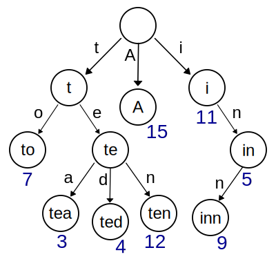

# go-fasttld


[](LICENSE)
[](https://goreportcard.com/report/github.com/elliotwutingfeng/go-fasttld)

**go-fasttld** is a high performance [top level domains (TLD)](https://en.wikipedia.org/wiki/Top-level_domain) extraction module implemented with [compressed tries](https://en.wikipedia.org/wiki/Trie).

This module is a port of the Python [fasttld](https://github.com/jophy/fasttld) module, with additional modifications to support extraction of subcomponents from full URLs and IPv4 addresses.



## Background

**go-fasttld** extracts subcomponents like [top level domains (TLDs)](https://en.wikipedia.org/wiki/Top-level_domain), subdomains and hostnames from [URLs](https://en.wikipedia.org/wiki/URL) efficiently by using the regularly-updated [Mozilla Public Suffix List](http://www.publicsuffix.org) and the [compressed trie](https://en.wikipedia.org/wiki/Trie) data structure.

For example, it extracts the `com` TLD, `maps` subdomain, and `google` domain from `https://maps.google.com:8080/a/long/path/?query=42`.

**go-fasttld** also supports extraction of private domains listed in the [Mozilla Public Suffix List](http://www.publicsuffix.org) like 'blogspot.co.uk' and 'sinaapp.com', and extraction of IPv4 addresses (e.g. https://127.0.0.1).

### Why not split on "." and take the last element instead?

Splitting on "." and taking the last element only works for simple TLDs like `.com`, but not more complex ones like `oseto.nagasaki.jp`.

## Installation

```sh
go get github.com/elliotwutingfeng/go-fasttld
```

## Quick Start

Full demo available in the _examples_ folder

```go
// Initialise fasttld extractor
extractor, _ := fasttld.New(fasttld.SuffixListParams{})

//Extract URL subcomponents
url := "https://a.long.subdomain.ox.ac.uk:5000/a/b/c/d/e/f/g/h/i?id=42"
res := extractor.Extract(fasttld.UrlParams{Url: url})

// Display results
fmt.Println(res.SubDomain)        // a.long.subdomain
fmt.Println(res.Domain)           // ox
fmt.Println(res.Suffix)           // ac.uk
fmt.Println(res.RegisteredDomain) // ox.ac.uk
fmt.Println(res.Port) // 5000
```

## Public Suffix List options

### Specify custom public suffix list file

You can use a custom public suffix list file by setting `CacheFilePath` in `fasttld.SuffixListParams{}` to its absolute path.

```go
cacheFilePath := "/absolute/path/to/file.dat"
extractor, _ := fasttld.New(fasttld.SuffixListParams{CacheFilePath: cacheFilePath})
```

### Updating the default Public Suffix List cache

Whenever `fasttld.New` is called without specifying `CacheFilePath` in `fasttld.SuffixListParams{}`, the local cache of the default Public Suffix List is updated automatically if it is more than 3 days old. You can also manually update the cache by using `Update()`.

```go
// Automatic update performed if `CacheFilePath` is not specified
// and local cache is more than 3 days old
extractor, _ := fasttld.New(fasttld.SuffixListParams{})

// Manually update local cache
showLogMessages := false
if err := extractor.Update(showLogMessages); err != nil {
	log.Println(err)
}
```

### Private domains

According to the [Mozilla.org wiki](https://wiki.mozilla.org/Public_Suffix_List/Uses), the Mozilla Public Suffix List contains private domains like `blogspot.com` and `sinaapp.com`.

By default, **go-fasttld** _excludes_ these private domains (i.e. `IncludePrivateSuffix = false`)

```go
extractor, _ := fasttld.New(fasttld.SuffixListParams{})

url := "https://google.blogspot.com"
res := extractor.Extract(fasttld.UrlParams{Url: url})

// res.SubDomain = google , res.Domain = blogspot , res.Suffix = com , res.RegisteredDomain = blogspot.com , res.Port = <no output>
```

You can _include_ private domains by setting `IncludePrivateSuffix = true`

```go
extractor, _ := fasttld.New(fasttld.SuffixListParams{IncludePrivateSuffix: true})

url := "https://google.blogspot.com"
res := extractor.Extract(fasttld.UrlParams{Url: url})

// res.SubDomain = <no output> , res.Domain = google , res.Suffix = blogspot.com , res.RegisteredDomain = google.blogspot.com , res.Port = <no output>
```

## Extraction options

### Ignore Subdomains

You can ignore subdomains by setting `IgnoreSubDomains = true`. By default, subdomains are extracted.

```go
extractor, _ := fasttld.New(fasttld.SuffixListParams{})

url := "https://maps.google.com"
res := extractor.Extract(fasttld.UrlParams{Url: url, IgnoreSubDomains: true})

// res.SubDomain = <no output> , res.Domain = google , res.Suffix = com , res.RegisteredDomain = google.com , res.Port = <no output>
```

### Punycode

Convert internationalised URLs to [punycode](https://en.wikipedia.org/wiki/Punycode) before extraction by setting `ConvertURLToPunyCode = true`. By default, URLs are not converted to punycode.

```go
extractor, _ := fasttld.New(fasttld.SuffixListParams{})

url := "https://hello.世界.com"
res := extractor.Extract(fasttld.UrlParams{Url: url, ConvertURLToPunyCode: true})

// res.SubDomain = hello , res.Domain = xn--rhqv96g , res.Suffix = com , res.RegisteredDomain = xn--rhqv96g.com , res.Port = <no output>

res = extractor.Extract(fasttld.UrlParams{Url: url, ConvertURLToPunyCode: false})

// res.SubDomain = hello , res.Domain = 世界 , res.Suffix = com , res.RegisteredDomain = 世界.com , res.Port = <no output>
```

## Testing

```sh
go test -v -coverprofile=test_coverage.out && go tool cover -html=test_coverage.out -o test_coverage.html
```

## Benchmarking

```sh
go test -bench=. -benchmem
```

## Acknowledgements

- [fasttld (Python)](https://github.com/jophy/fasttld)
- [tldextract (Python)](https://github.com/john-kurkowski/tldextract)
- [tldextract (Go)](https://github.com/mjd2021usa/tldextract)
